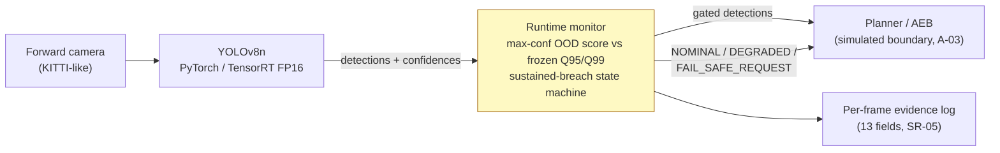

# Safety-Monitored Edge Perception for ADAS

Camera-only pedestrian/vehicle/cyclist detection (YOLOv8n on KITTI, TensorRT FP16) supervised by a runtime monitor that knows when *not* to trust itself: calibrated confidence + frame-level OOD score → frozen validation-only thresholds → `NOMINAL / DEGRADED / FAIL_SAFE_REQUEST` gating — wrapped in STPA/HARA-derived requirements, a GSN safety case, a SOTIF argument, and machine-readable requirement-to-evidence traceability.

> Status: **Shipped** (10/10 weeks). Paper: [paper/main.pdf](paper/main.pdf) ([source](paper/main.md)). Demo: [demo/final_demo.mp4](demo/final_demo.mp4) (~72 s) · GIF below. Reproduce: [docs/final_reproduction.md](docs/final_reproduction.md). SR-01..06 verified; the headline honest result: the monitor flags **99%** of frames under severe synthetic fog (mAP50 0.847→0.071) but misses gradual low-light erosion (−19% mAP50 at 97.7% NOMINAL) — documented as a SOTIF residual, not hidden.


*KITTI → BDD night/rain/fog sequence. Green = NOMINAL, orange = DEGRADED, red = FAIL_SAFE_REQUEST. Illustrative only — all metrics come from the CSV artifacts below. Full video: `demo/monitor_overlay.mp4`.*

## Motivation

Two earlier threads collided into this project. I first stumbled on YOLO while doing an IoT seminar research project — that's where real-time object detection on constrained edge hardware stopped being an abstraction and became something I wanted to actually run. Separately, working on an ECG digital-twin project is where I started taking *safety* seriously as an engineering discipline: a model that is usually right isn't enough when being wrong has consequences; you have to reason about *when the model should not be trusted*, and make that failure observable.

This repo is the deliberate intersection of the two — an edge-ML detector wrapped in that safety mindset. The point was never to maximize mAP; it was to build the runtime evidence and the argument for when the perception stack should not be trusted. The documented low-light blind spot below is that instinct paying off: the interesting result is not that the monitor works, but that the campaign found and recorded where it doesn't.

## Architecture



Safety derivation: HARA-lite (worked S3/E4/C3 → ASIL D educational example) + STPA (9 UCAs, 9 causal scenarios) → six measurable requirements **SR-01..SR-06** → scripted verification → GSN safety case.

[](safety/safety_case.md)

## Key results

All numbers script-generated (`scripts/build_report_assets.py` → `results/report_summary.json`, `paper/tables.md`); experiment commands in [docs/experiment_log.md](docs/experiment_log.md). Seed 42 everywhere; RTX 3050 Ti Laptop 4 GB.

**Detector baseline** (kitti-val, EXP-003/004 — `results/baseline_metrics.csv`)

| Backend | mAP50 | mAP50-95 | AP50 ped/veh/cyc | detector p95 |
|---|---|---|---|---|
| PyTorch | 0.8588 | 0.5561 | 0.749 / 0.948 / 0.880 | 20.6 ms |
| TensorRT FP16 | 0.8564 (Δ −0.0024) | 0.5584 | 0.745 / 0.947 / 0.877 | 18.0 ms |

**Monitor evidence** (EXP-006..009 — `results/calibration_metrics.csv`, `ood_metrics.csv`, `risk_coverage.csv`, `monitor_latency_metrics.csv`)

| What | Result |
|---|---|
| Calibration (temperature scaling, T=0.600) | ECE **0.081 → 0.039** on disjoint report subset |
| OOD AUROC vs kitti-val (max-conf) | night **0.982**, rain 0.876, fog 0.926 (n=13), clear-day control 0.758 |
| Frozen thresholds (kitti-val only) | Q95 = 0.1862 (DEGRADED), Q99 = 0.3728 (FAIL_SAFE) |
| Coverage at Q95 | keeps **94.8%** of ID frames; accepts only **6%** of night |
| Gating | 7/7 deterministic scenarios; zero false transitions on 300 ID frames |
| Full-loop latency (predict+score+state+log) | TRT **p95 17.2 ms** / PyTorch 17.5 ms vs 40 ms budget |

**Fault injection** (300 kitti-test frames, report-only, EXP-010 — `results/fault_injection_metrics.csv`)

| Condition | mAP50 | Monitor response |
|---|---|---|
| clean | 0.847 | 98.3% NOMINAL, zero fail-safe |
| fog:high | **0.071** | **99% flagged non-NOMINAL** |
| motion_blur:high | 0.251 | 78% FAIL_SAFE_REQUEST |
| gaussian_noise:high | 0.365 | 77% FAIL_SAFE_REQUEST |
| **low_light:high** | **0.689 (−19%)** | **97.7% NOMINAL — documented blind spot** |

The low-light row is the point of the project: frame-level max-confidence cannot see silent recall erosion. Carried as an explicit residual in the [safety case](safety/safety_case.md) and [SOTIF argument](safety/sotif_argument.md); mitigations (detection-count plausibility, temporal checks, Mahalanobis) are stated future work, not claims.

## Safety artifacts

| Artifact | Content |
|---|---|
| [safety/hara_lite.md](safety/hara_lite.md) / [stpa_report.md](safety/stpa_report.md) | Hazard analysis; UCAs; causal scenarios; SR derivation |
| [safety/requirements.csv](safety/requirements.csv) | SR-01..06 with measurable acceptance criteria |
| [safety/traceability_matrix.csv](safety/traceability_matrix.csv) | SR → implementation → test → metric → result → evidence (all `verified`) |
| [safety/verification_report.md](safety/verification_report.md) | SR-by-SR verification narrative + EXP-010 findings |
| [safety/safety_case.md](safety/safety_case.md) + [gsn.svg](safety/gsn.svg) | Bounded top claim, GSN one-pager, residual-risk register |
| [safety/sotif_argument.md](safety/sotif_argument.md) | Known/unknown-safe/unsafe classification of explored conditions |
| [safety/iso_pas_8800_mapping.md](safety/iso_pas_8800_mapping.md) | 11-theme alignment table with explicit gaps |
| [safety/evidence_index.csv](safety/evidence_index.csv) | 24 claims → evidence files → experiments → requirements |

## Reproduction

```bash
pip install -r requirements.txt              # + requirements-export.txt for TensorRT (read its warning)
# data: KITTI object detection -> data/raw/kitti ; BDD100K 100k val -> data/raw/bdd100k (docs/dataset_splits.md)

python -m src.dataset.validate_kitti --root data/raw/kitti --out results/kitti_validation.json
python -m src.dataset.make_splits --root data/raw/kitti --seed 42        # splits committed; do not regenerate silently
python scripts/train_baseline.py --epochs 50                             # EXP-003
python scripts/export_trt.py --trt                                       # EXP-004: ONNX + TRT FP16
python scripts/evaluate_monitor.py                                       # EXP-006..008: calibrate, slices, OOD, thresholds, risk-coverage
python scripts/run_demo.py                                               # EXP-009: gating tests, latency+log, demo video
python scripts/run_fault_injection.py                                    # EXP-010: 16 conditions x 300 test frames
python scripts/build_report_assets.py                                    # tables + summary + GIF
python -m pytest tests/ -q                                               # 88 tests
```

## Repository layout

```
configs/    dataset split lists + hashes (committed, canonical)
docs/       project spec (ODD, assumptions), experiment log EXP-001..012, dataset notes
src/        dataset | monitor (calibration, scoring, thresholds, state_machine, runtime)
scripts/    train_baseline · export_trt · evaluate_monitor · run_demo · run_fault_injection · build_report_assets
safety/     requirements, traceability, HARA/STPA, verification report, GSN, SOTIF, 8800 mapping
results/    machine-readable metrics (CSV/JSON) + plots — the only source of any claim
paper/      IEEE-style draft (main.md) + generated tables.md
demo/       monitor_overlay.mp4 / .gif (illustrative only)
```

## Limitations

- **Not certified, not ISO-compliant, not proven safe.** Claims are bounded to the KITTI-like ODD and phrased as alignment; every safety claim cites an evidence file or appears here.
- Planner/actuator are simulated boundaries; fail-safe is a *request* (assumption A-03, untested).
- Corruptions are plausibility models, not weather physics; BDD fog slice n=13.
- Low-light blind spot documented, not fixed. Thresholds are KITTI-val-specific (clear-day control AUROC 0.76 shows cross-domain transfer fails).
- HARA ratings illustrative; single hazard worked fully; INT8 deferred (FP16 met budget).
